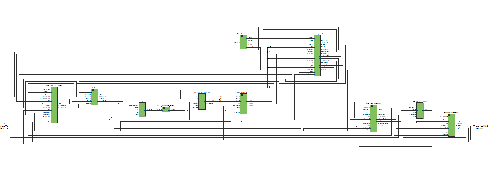
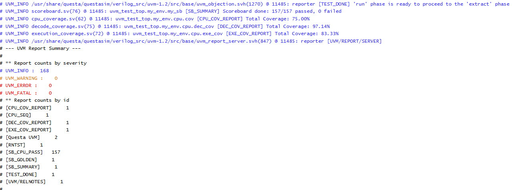
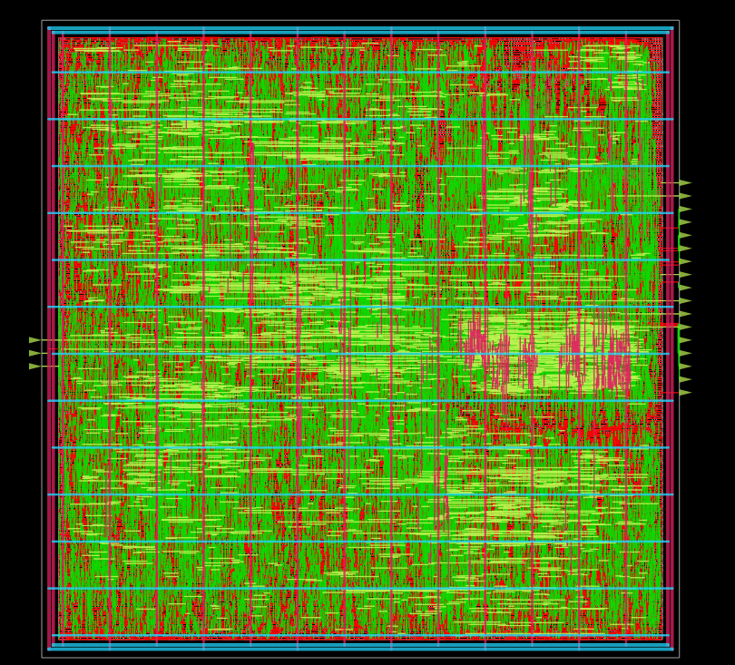

# RTL & CPU Architecture

## Architectural Overview
The core of this project is a fully synthesizable, **5-stage pipelined RISC CPU** engineered to handle data and control hazards efficiently while maintaining a compact hardware footprint. 

### Pipeline Stages
1. **Fetch (IF):** Fetches the 21-bit instruction from instruction memory using the Program Counter (PC).
2. **Decode (ID):** Decodes the opcode, reads from the register file, and generates control signals.
3. **Execute (EX):** Performs arithmetic, logical, or shifting operations via the ALU.
4. **Memory (MEM):** Handles synchronous data memory load and store transactions.
5. **Write-Back (WB):** Commits execution or memory results back to the register file.

### Key Hardware Features
* **Word Size & Storage:** Features a **16-bit data path** supporting signed operations. The storage architecture includes a **16-word Register File** and **256 indices of Data Memory**.
* **Hazard Mitigation:** Integrated a robust **Forwarding Unit** to resolve Read-After-Write (RAW) data hazards dynamically, minimizing pipeline stalls during back-to-back register dependencies and load/store sequences.
* **Power Management:** Includes an `en_cpu` global clock-enable signal acting as a low-power sleep or stalling mechanism when integrated into larger top-level systems.
* **Future Optimization (TODO):** Implement fine-grained **clock gating** within individual pipeline registers to significantly reduce dynamic power consumption during stall cycles.


## Instruction Set Architecture (ISA)

The CPU utilizes a custom **21-bit fixed-width instruction layout** supporting 20 distinct operations across R-type, I-type, and J-type formats.

### Instruction Format
```text
+-------------------+-----------------+-----------------------+------------------------+
|   Opcode (5 bits) |   RS1 (4 bits)  |  RS2 / Imm (8 bits)   |      RD (4 bits)       |
+-------------------+-----------------+-----------------------+------------------------+
```

### Op Code
- 0 (NO-OP): produce all 0s
- 1 (ADD): reg1, reg2, reg_dest -> RD <= RS1 + RS2
- 2 (AND): reg1, reg2, reg_dest -> RD <= RS1 & RS2
- 3 (SUB): reg1, reg2, reg_dest -> RD <= RS1 - RS2
- 4 (OR): reg1, reg2, reg_dest -> RD <= RS1 | RS2
- 5 (XOR): reg1, reg2, reg_dest -> RD <= RS1 ^ RS2
- 6 (LS): reg1, reg2, reg_dest -> RD <= RS1 << RS2 (Logical Left Shift)
- 7 (RS): reg1, reg2, reg_dest -> RD <= RS1 >> RS2 (Logical Right Shift)
- 8 (MULT): reg1, reg2, reg_dest -> RD <= RS1 * RS2
- 9 (ADDI): reg1, immd, reg_dest -> RD <= RS1 + Imm (Signed Immediate)
- 10 (ANDI): reg1, immd, reg_dest -> RD <= RS1 & Imm
- 11 (SUBI): reg1, immd, reg_dest -> RD <= RS1 - Imm
- 12 (ORI): reg1, immd, reg_dest -> RD <= RS1 | Imm
- 13 (XORI): reg1, immd, reg_dest -> RD <= RS1 ^ Imm (Supports signed values)
- 14 (LSI): reg1, immd, reg_dest -> RD <= RS1 << Imm
- 15 (RSI): reg1, immd, reg_dest -> RD <= RS1 >> Imm
- 16 (MULTI): reg1, immd, reg_dest -> RD <= RS1 * Imm
- 17 (NOT): reg1 -> RD <= ~RS1 (Bitwise Inversion)
- 18 (STR): reg_str_addr, reg_addr -> Mem[RS2] <= RS1 (Store Word to Address)
- 19 (LW): reg_lw_addr, reg_dest -> RD <= Mem[RS1] (Load Word from Address)
- 20 (BNE): reg_comp_1, reg_comp2, reg_branch_idx -> Branch to Imm target if RS1 != RS2

## Support Software & Local Verification Flow

### 1. Python-Based Assembler & Co-Simulation Model
To automate program execution on this custom hardware, a custom Python assembler (`assembler/assembler.py`) was built. It parses standard assembly mnemonics written in `program.txt` and automatically generates:
* **Machine Code (`out.txt`):** Binary/Hex representation loaded directly into the CPU instruction memory.
* **Golden Execution Model (`golden.txt`):** Generates a cycle-by-cycle behavioral prediction of register and data memory states used to feed the verification environments.

### 2. Local RTL Linting & Simulation Toolchain
Local RTL verification is fully automated via a unified shell script (`run_sim.sh`) utilizing open-source EDA tools:

* **Static Code Linting:** Uses **Verilator** to perform strict linting checks across all pipeline stages and control modules, piping warnings and errors directly to `lint.txt` to ensure synthesis-ready code.
* **Compilation & Hardware Simulation:** Compiled using **Icarus Verilog (`iverilog`)** by tracking structural dependencies from the pipeline registers up to the top-level `cpu_top.v` wrapper and direct-test structural testbench (`cpu_top_tb.v`). 
* **Execution & Verification:** Simulated using the **VVP runtime engine**, outputting simulation logs to `results.txt`. The testbench parses `out.txt` into instruction memory and uses a file-I/O comparison mechanism to cross-check DUT register writebacks against the assembler-generated `golden.txt` on every clock cycle.

### 3. Gate-Level Simulation (GLS) Sign-off
Following logic synthesis, structural integrity and timing constraints are verified using a Gate-Level Simulation pipeline (`run_gls.sh`):
* **Netlist Validation:** The toolchain swaps the high-level RTL behavior with the technology-mapped gate-level netlist generated during the worst-case timing corner (`cpu_top_slow_netlist.v`).
* **PDK Cell Binding:** Compiles the netlist against structural cell models and standard cell primitives (`primitives.v` and `sky130_fd_sc_hdll.v`) from the **SkyWater 130nm PDK** library.
* **Dynamic Verifcation:** Executes the direct-test testbench layer (`cpu_top_tb.v`) with `-DFUNCTIONAL` macro flags over the gate-level primitives under the VVP engine to guarantee that no synthesis optimization routines altered or broken the logical control flow.

### Unit Testbench
In addition to the main UVM environment, a lightweight, direct-test structural testbench is included for rapid hardware validation. It reads `out.txt` into the DUT's instruction memory and uses a file-I/O comparison mechanism to validate DUT register writebacks against the assembler-generated `golden.txt` on every clock cycle.

## Quartus Layout


# UVM Verification Environment
**EDA Playground Link:** [Launch Live UVM Simulation](https://edaplayground.com/x/jP8b)

While the local Icarus Verilog environment handles rapid, deterministic unit testing, an enterprise-grade **Universal Verification Methodology (UVM)** environment was architected to perform constrained-random verification and deep functional coverage metrics. 

> Due to the complex licensing and library requirements of UVM base classes, the complete UVM environment is hosted and executed via **EDA Playground**. Click the simulation link above to view, modify, and run the testbench dynamically using commercial-grade simulators (e.g., Aldec Riviera-PRO or Synopsys VCS).

### Environment Architecture
* **Verification Infrastructure:** Implemented a structured hierarchy consisting of a `uvm_env` containing multiple specialized verification components.
* **Stimulus Generation:** Utilized a **Virtual Sequencer** to coordinate traffic across multiple interface-specific sequencers and drive concurrent, constrained-random instruction sequences.
* **Checking Mechanism:** Built a dynamic **Scoreboard** that leverages a golden solution model to predict expected CPU behavior and perform real-time data integrity checks.
* **Data Collection & Analysis:** Deployed independent **Monitors** and **Drivers** per interface to observe and drive pin-level activity, feeding transactions via TLM ports to the scoreboard and functional coverage collectors.
* **Assertion-Based Verification (ABV):** Embedded inline and interface-bound **SystemVerilog Assertions (SVA)** to catch timing, control path, and protocol violations immediately at the source.

## Environment Architecture
* Verification Infrastructure: Implemented a structured hierarchy consisting of a uvm_env containing multiple specialized verification components.

* Stimulus Generation: Utilized a Virtual Sequencer to coordinate traffic across multiple interface-specific sequencers and drive concurrent, constrained-random instruction sequences.

* Checking Mechanism: Built a dynamic Scoreboard that leverages a golden solution model to predict expected CPU behavior and perform real-time data integrity checks.

* Data Collection & Analysis: Deployed independent Monitors and Drivers per interface to observe and drive pin-level activity, feeding transactions via TLM ports to the scoreboard and functional coverage collectors.

* Assertion-Based Verification (ABV): Embedded inline and interface-bound SystemVerilog Assertions (SVA) to catch timing, control path, and protocol violations immediately at the source.

## Verification Zones & Interfaces
1. CPU Core Interface (End-to-End Checking)
* Purpose: Verifies the full execution cycle and behavioral correctness of the CPU pipeline.

* Mechanism: The testbench loads targeted instructions into the DUT memory space. Simultaneously, expected execution results are calculated and pushed into a Golden Solution Queue within the Scoreboard.

* Validation: As the CPU completes instruction execution, the output monitor captures the resulting register/memory writebacks and passes them to the Scoreboard, where they are strict-ordered compared against the front of the golden queue.

2. Decode / Execution Interface (White-Box Coverage)
* Purpose: Focuses on internal state transitions, pipeline control path logic, and instruction decoding accuracy.

* Hazard & Stall Compliance: Stall signals assert correctly on read-after-write (RAW) hazards and deassert properly when the hazard clears.

* Control Flow Integrity: Flushes occur deterministically within the correct clock cycle following a taken branch or misprediction.

* Protocol Bounds: Immediate values (such as negative offsets in XORI or branch distances in BNE) remain valid and do not cause illegal states.

* Functional Coverage Tracker: Implemented comprehensive covergroup and coverpoint constructs to ensure high verification density. This tracks the distribution of:

* Control Flags: Forwarding paths, hazard detection stalls, flush triggers, and branch decisions.

* Register Indices: Source (rs, rt) and destination (rd) register access patterns to ensure no data hazards are missed.

* ALU Operations: Cross-coverage of operations (e.g., ADD, SUB, XORI, BNE) against various immediate and signed value ranges to confirm complete execution-space coverage.

## Verification Results
Below is the functional coverage report generated by the simulation, demonstrating complete coverage across the defined instruction space, register matrices, pipeline hazard scenarios, and assertion pass rates.
`Achieved ~86% coverage` across all three interfaces. Improvements to this section would be to write a random generator just like the python script. That would generate a random sequence of operations and produce
a golden solution. Both of which would be driven in the test environment.



# Synthesis & Static Timing Analysis (STA)

The physical design front-end flow maps the high-level RTL description to a technology-mapped gate-level netlist using open-source EDA tools and the **SkyWater 130nm (SKY130) PDK** (`sky130_fd_sc_hdll`).

## 1. Multi-Corner Logic Synthesis (Yosys)
Synthesis is driven by a custom automation script (`run_synth.tcl`) that structures, optimizes, and maps the design across **three Process-Voltage-Temperature (PVT) process corners** sequentially to verify structural integrity under extreme operating conditions:

* **Slow Corner (Worst-Case Timing):** `sky130_fd_sc_hdll__ss_100C_1v60.lib` (Slow-Slow, 100°C, 1.60V) — Used to validate setup timing limits.
* **Typical Corner (Nominal Operations):** `sky130_fd_sc_hdll__tt_025C_1v80.lib` (Typical-Typical, 25°C, 1.80V).
* **Fast Corner (Best-Case / Hold Timing):** `sky130_fd_sc_hdll__ff_n40C_1v95.lib` (Fast-Fast, -40°C, 1.95V) — Used to validate hold constraints and leakage metrics.

### Synthesis Optimization Strategy
1. **Elaboration & Flattening:** The structural design reads all sub-modules and compiles around the `cpu_top` root module, tracking pipeline hierarchy boundaries before flattening (`synth -flatten -booth`) and extracting Booth-encoded arithmetic multipliers.
2. **Sequential Mapping:** Register primitives are explicitly bound to technology-mapped sequential cells via `dfflibmap`.
3. **Advanced ABC Technology Mapping:** Logic optimization is pushed through the **ABC synthesis engine** using a customized script recipe (`constraints/abc_settings`) targeting an execution delay parameter of **10.0ns ($10000\text{ ps}$)**. The compilation flow enforces:
    * **Structural & Functional Reduction:** Utilizes AIG-based rewriting, choice-history synthesis, and register retiming routines (`strash`, `&fraig`, `&dch`, `dretime`, `retime -o -D 10000`) to minimize logic depth.
    * **Technology Mapping & Buffering:** Binds random logic explicitly to the SKY130 liberty cells while incorporating timing-driven gate insertion and cell sizing (`&nf`, `buffer`, `upsize`, `dnsize`, `buffer -N 4`).
    * **Wire Load & Driver Modeling (`constraints/constr.abc`):** Constrains input paths assuming a standard `sky130_fd_sc_hdll__inv_4` driving cell and bounds all output ports to a capacitive load of **0.05pF**.
4. **Clean & Purge:** Inserts tie-high and tie-low constants (`sky130_fd_sc_hdll__conb_1 HI LO`), splits multi-bit net buses to clean up layout wire structures, and outputs corner-specific gate-level netlists (`cpu_top_corner_netlist.v`) alongside design area summaries.


## 2. Gate-Level Static Timing Analysis (OpenSTA)
To sign off on timing before moving to physical layout (Place & Route), **OpenSTA** evaluates the synthesized netlists across all three PVT corners via an automated timing verification run (`run_sta.tcl`).

### Design Constraints (SDC) Configuration
The core timing margins, clock topologies, and environmental design rules are established explicitly within `constraints/cpu_top.sdc`:

* **Clock Network Definition:** Defines a primary synchronous clock (`clk`) targeting a **10ns period**.
* **Timing Margins & Jitter:** Accounts for clock network non-idealities by modeling a **0.3ns setup uncertainty** and a **0.05ns hold uncertainty**.
* **Boundary Delays:** Enforces boundary constraints with **4.0ns maximum / 0.0ns minimum** input and output external propagation delay windows on all peripheral ports relative to the clock edge.
* **Design Rule Checks (DRC):**
    * **Max Fan-out:** Constrained to a maximum limit of **5** loads per net to control capacitive propagation delays.
    * **Max Slew / Transition:** Bounded to **1.2ns** across the entire design, with input transitions restricted to a maximum of **0.5ns**.
    * **Max Capacitance:** Hard-limited to a maximum threshold of **0.05pF** on all outputs.
* **Timing Derating (Pessimism):** Implements variation buffers with global derating coefficients set to **1.03 for late paths** (setup risk) and **0.97 for early paths** (hold risk) across both cells and nets.

### Advanced Timing Reports Generated
The analysis evaluates the design constraints and generates isolated design rule checking (DRC) and timing violation reports in `output/<corner_name>/`:

* **`setup_timing.rpt` & `hold_timing.rpt`:** Complete clock-expanded path analysis detailing Worst Negative Slack (WNS) and Total Negative Slack (TNS) for data-path setup and hold margins.
* **`wns.rpt` & `tns.rpt`:** Summarized timing slack registers tracking design margins.
* **`slew_drv.rpt`:** Identifies max transition/slew rate violations along critical data paths and clock networks.
* **`cap_drv.rpt`:** Flags nodes exceeding maximum technology capacitance parameters.
* **`fanout_drv.rpt`:** Tallies high fan-out nets causing propagation delays on control-path signals.


# Physical Design (P&R) & GDSII Sign-off

The physical implementation flow converts the technology-mapped gate-level netlist into manufacturing-ready **GDSII** blueprints using **OpenROAD** and **Magic VLSI** driven by the **SkyWater 130nm PDK** (`sky130_fd_sc_hdll`).


## 1. Physical Layout Pipeline (OpenROAD Automation)

The backend Place & Route pipeline is modularly automated through distinct Tcl command scripts to progressively layout, power, buffer, route, and analyze the 5-stage pipelined CPU architecture.

### A. Floorplanning & Power Distribution Network (`floorplan.tcl`)
Initializes the physical boundary, cell row orientation, macro structures, and power delivery:
* **Core Optimization & Utilization:** Configured to an aggressive **75% core utilization target** with an aspect ratio of 1.0 (square die structure) to compress cell placement and minimize interconnect routing lengths.
* **Physical Guardbanding:** Automatically inserts technology tapcells (`sky130_fd_sc_hdll__tapvpwrvgnd_1`) and boundary endcaps to eliminate latch-up risks.
* **Power Mesh Assembly (PDN):** Builds a robust dual-rail power grid topology hooking up VDD (1.8V) and VSS (Ground). It spans a Metal 4 / Metal 5 power ring (width: 3.0µm, spacing: 2.0µm) alongside uniform Metal 1 followpins and vertical Metal 4 distribution stripes pitched at 112.0µm intervals.

### B. Standard Cell Placement (`placement.tcl`)
Maps and clusters logic gates across core rows while minimizing global wire lengths:
* **Timing-Driven Macro Optimization:** Executes `-timing_driven` and `-routability_driven` global placement passes. Parasitic estimations are established early using Metal 3 tracking parameters (`set_wire_rc -layer met3`).
* **Design Rule Violations (DRV) Repair:** Automatically executes high-fanout, input port buffering, and logic sizing checks (`buffer_ports -inputs`, `repair_design`, `repair_timing`) before hardening cell geometries with an incremental detailed placement optimization pass.

### C. Clock Tree Synthesis / CTS (`CTS.tcl`)
Constructs a balanced clock distribution network to deliver a low-skew, sharp-transition synchronous clock flag across all 5 pipeline stage register arrays:
* **Buffer Strategy:** Leverages a high-drive cell buffer palette (`sky130_fd_sc_hdll__clkbuf_2, 4, 8, 16`) to build the tree structure.
* **Tight Characterization Limits:** Constrains tree compilation with strict upper limits targeting a **maximum slew of 0.8ns** and a **maximum capacitive load of 0.50pF** to enforce deterministic sampling boundaries.
* **Timing Closure:** Performs dedicated cell/net resizing loops (`repair_clock_nets`, `repair_timing`, `repair_design -slew_margin 0.8`) coupled with incremental detailed placement.

### D. Global & Detailed Routing (`routing.tcl`)
Establishes the physical copper interconnections across layout metal layers without generating DRC metal shorts:
* **Routing Execution:** Drives global routing grids followed by detailed track optimization passes, outputting an isolated routing violations log (`reports/5_route_drc.rpt`).
* **Antenna Mitigation:** Evaluates layout paths for high-ratio metal-to-gate charge accumulation risks (`check_antennas`) and injects layout-level protection diodes (`repair_antennas`) automatically.
* **Filler Cell Insertion:** Packs remaining layout whitespace using PDK filler primitives (`sky130_fd_sc_hdll__fill_1, 2, 4, 8`) to preserve continuous well layers.

### E. Parasitic Extraction (`extract.tcl` & `report.tcl`)
Signs off on the post-routing physical metrics:
* **Abstract Extraction:** Generates an engineering design abstract layout (`metals/cpu_top.lef`).
* **Delay Extraction:** Computes exact wire RC parasitics and exports standard Synopsys delay profiles (`metals/cpu_top.sdf`) for post-layout timing checks.
* **Sign-off Logs:** Generates thorough post-routing reports (`reports/`) validating setup timing (`setup_timing.rpt`), hold timing (`hold_timing.rpt`), and remaining DRVs (`slew_drv.rpt`, `cap_drv.rpt`, `fanout_drv.rpt`).


## 2. GDSII Stream-Out & DRC Sign-off (Magic)

Once the routed design abstract is finalized in OpenROAD (`output/cpu_top_routed.def`), the design is passed to **Magic VLSI** (`gds_script.tcl` & `magic_gds.tcl`) to construct full structural silicon layout profiles.

### GDSII Generation Strategy
1. **PDK GDS Consolidation:** Reads the standard cell structural GDS data library directly (`sky130_fd_sc_hdll.gds`) alongside layout LEF definitions.
2. **Def Interpretation:** Merges the structural cells into the routed DEF geometry locations to flesh out complete layered masks (`load cpu_top`).
3. **Stream-Out:** Streams out manufacturing-ready layouts to `gds/final_cpu_top.gds`.
4. **Hardware DRC Check:** Re-enables the hardware Design Rule Checker (`drc check`) to verify edge spacing, metal widths, and enclosure rules, saving the results to a layout diagnostic log (`gds/drc_signoff.log`).


# Physical Design Challenges & Solutions

### 1. Timing Violations due to High Load Capacitance & Slew
* **Problem:** Initial synthesis iterations on a single-cycle CPU architecture revealed significant max-slew and max-capacitance violations. The massive combinational fan-out from the decode logic driving the entire execution space caused long, capacitive wire loads, high propagation delays, and severe setup timing failures.
* **Solution:** Redesigned the CPU core into a structured **5-stage pipelined architecture**. By isolating execution boundaries with pipeline registers, the fan-out load on any individual path was drastically reduced. During physical synthesis, constraint thresholds were set to explicitly bind larger driver sizes, limit maximum fan-out metrics (`set_max_fanout 4`), and enforce strict upper bounds on output capacitance load profiles (`set_max_capacitance 0.05`).

### 2. Critical Path Bottlenecks in the Execute Bypass Loop
* **Problem:** Introducing the 5-stage pipeline injected data hazards, particularly Read-After-Write (RAW) loops during consecutive arithmetic dependencies. Early structural implementations failed to clear setup slack constraints due to a long, deeply nested combinational path running from the ALU output, through the multi-stage Forwarding Unit logic, and directly back into the ALU execution operands. This EX-to-EX bypass became the design's limiting critical path, pinning the minimum clock period to 20ns.
* **Solution:** Redesigned the Forwarding Unit to tap operand values earlier at the Decode (ID) stage using dedicated register buffering. Isolating these forwarding parameters broke up the long combinational path, minimized the logic depth between stages, and allowed the stable target clock period to scale down safely from 20ns to 15ns without requiring performance-killing pipeline stalls.

### 3. Verification & Architecture for Random Pipeline Stalling
* **Problem:** Introducing random stall periods into the testbench to simulate asynchronous system delays caused data mismatch synchronization errors in the verification monitors and pipeline registers.
* **Solution:** * **Hardware Fix:** Tied all internal pipeline stage registers to a centralized global clock-enable (`en_cpu`). Pipeline data updates freeze deterministically when a stall event is registered, holding the data at the CPU outputs.
    * **Testbench Fix:** Updated the UVM monitor sampling mechanisms to evaluate signals safely relative to valid pipeline conditions, inserting specific flush sequences to clear valid residual data lingering at the processor boundary during stall lag phases.

### 4. High Slew & Setup Failures on Long Branching Reset Paths (`resetn`)
* **Problem:** Initial physical implementation maps exhibited severe setup timing and max-slew violations on the active-low global reset line (`resetn`). Because the reset signal roots out across every single pipeline register across all 5 stages, the long branching wire length introduced high RC parasitics, degraded signal transitions, and created a highly unstable reset tree structure that caused the most headaches during routing.
* **Solution:** Tightened the clock tree characterization script during the CTS synthesis pass to handle the heavy load profile directly using `configure_cts_characterization -max_slew 0.8 -max_cap 0.40`. Additionally, an explicit maximum transition boundary constraint was asserted directly on the port (`set_max_transition 0.4 [get_ports resetn]`), minimizing the load capacitance on the line and forcing OpenROAD to size up driving structures to keep transitions clean.

### 5. Pushing Layout Scaling Limits From 15ns Down to a 10ns Cycle Window
* **Problem:** Squeezing the design layout to close timing at an aggressive 10ns clock cycle target made interconnect wire delay the primary limiting factor, as the physical distance between standard cells introduced excessive propagation latency.
* **Solution:** Optimized the synthesis and physical design engines in tandem. The Yosys ABC synthesis recipe (`abc_settings`) was tweaked to map gates based on the strict targeted cycle range, explicitly preferring to increase area and upsize fan-out structures in exchange for raw performance gains. Concurrently, the physical layout footprint was compressed by raising the core utilization target to 75% in `floorplan.tcl` and further tightening the clock tree traits during CTS. This packed the standard cells tightly together on the silicon die, significantly lessening the distance of metal connections and eliminating remaining wire-induced setup violations.


# Automation & Execution Commands

The complete design pipeline—spanning high-level RTL verification, multi-corner logic synthesis, static timing verification, physical layout, and manufacturing stream-out—is driven by standardized modular automation scripts.

### 1. Front-End RTL Verification & Sign-off
```bash
# Execute local functional simulation and code linting
./run_sim.sh

# Run post-synthesis Gate-Level Simulation (GLS) using worst-case corner netlists
./run_gls.sh
```
### 2. Logic Synthesis & Timing Verification
```bash
# Execute multi-corner synthesis loop in Yosys
yosys -c run_synth.tcl &> synth.txt 

# Run Static Timing Analysis (STA) across all PVT corners via OpenSTA
sta run_sta.tcl
```

### 3. Openroad
```bash
# Run the complete place-and-route flow sequentially
openroad -no_init -exit floorplan.tcl &> floorplan.log
openroad -no_init -exit placement.tcl &> placement.log
openroad -no_init -exit CTS.tcl       &> cts.log
openroad -no_init -exit routing.tcl   &> routing.log
openroad -no_init -exit extract.tcl   &> extract.log
```

### 4. GDSII Stream-Out & DRC Sign-off (Magic)
```bash
# Generate layout masks and verify manufacturing design rules
./gds_script.tcl
```

# Physical Sign-off & Core Achievements
* Frequency Scaling: Successfully compressed the clock period from 20ns down to 10ns (100 MHz) while maintaining clean setup and hold margins through worst-case multi-corner physical design flows.

* Silicon Boundary Mastery: Pushed the open-source SkyWater 130nm PDK (sky130_fd_sc_hdll) to its optimal timing limits, resolving highly dense interconnect nets without compromising routing track access.

* Die and Area Density: Closed the layout within a tight 600x600 um area envelope with a finalized core placement utilization of 68% inside the standard cell rows.

* Tape-out Ready Geometry: Cleared final layout sign-off with zero Design Rule Checking (DRC) or Layout-vs-Schematic (LVS) errors. Post-GDSII parasitic extractions successfully validate full structural timing compliance, verifying the layout as completely ready for foundry fabrication.




